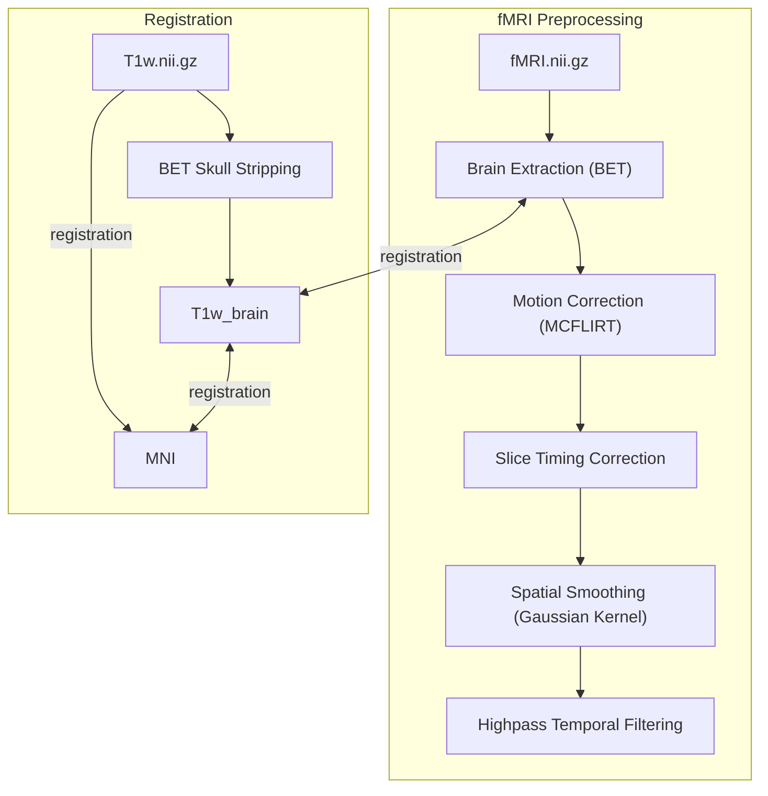
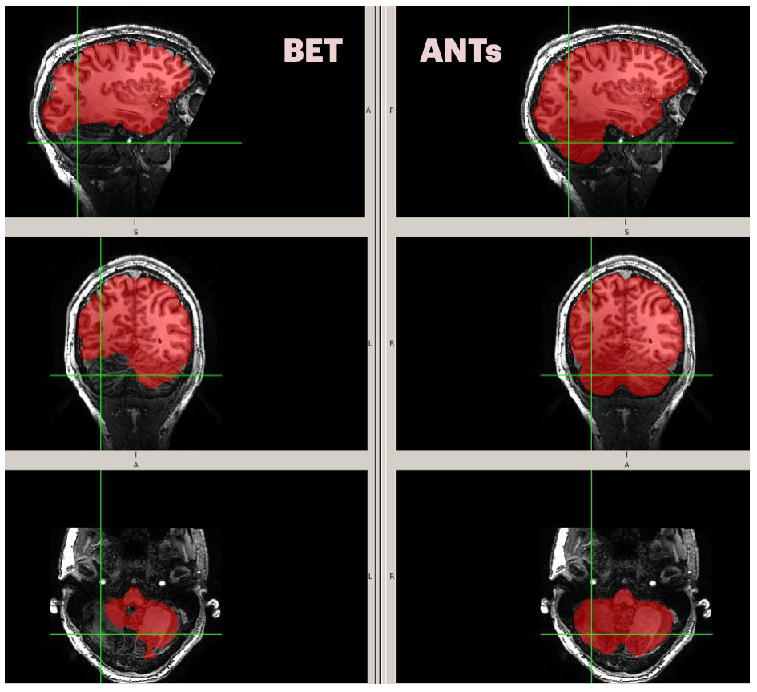
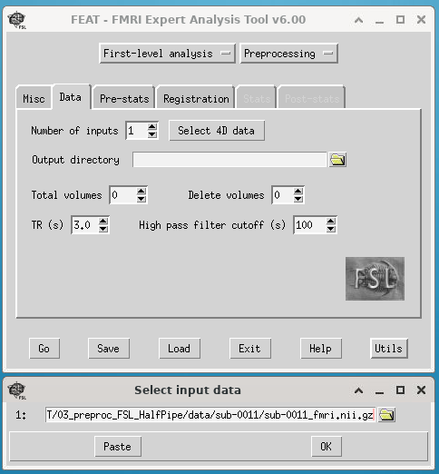
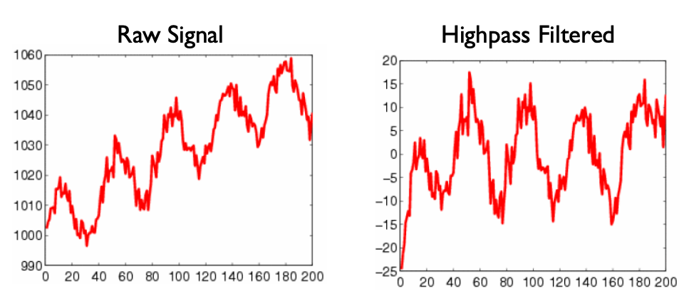
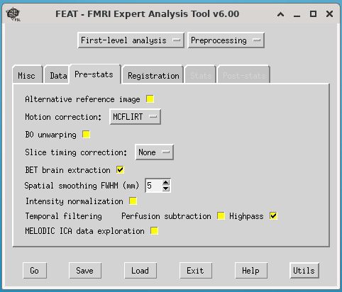
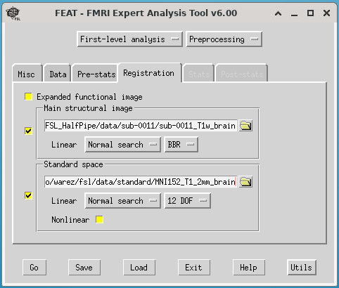
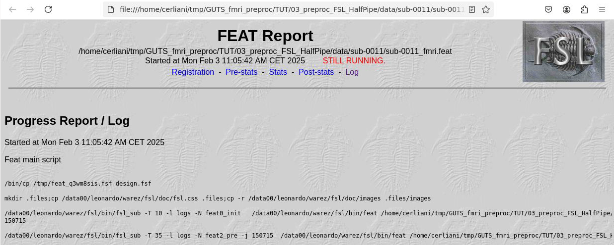
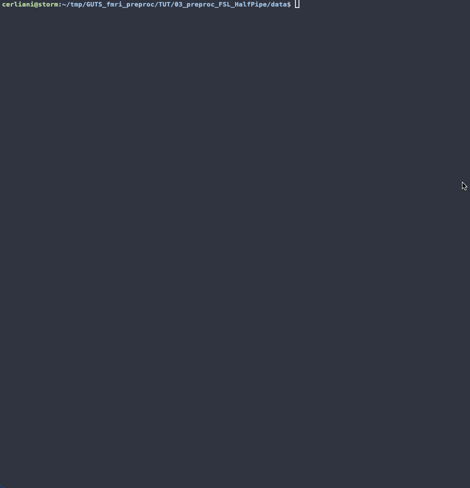
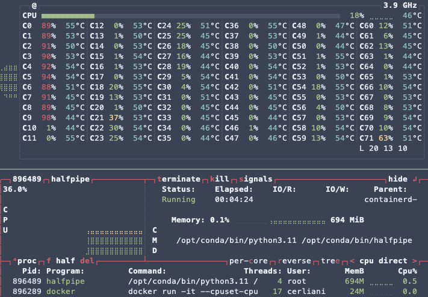

# Preprocessing fmri and T1w data with FSL FEAT and HalfPipe

_leonardo cerliani - 20250203_

We will see how to carry out a basic preprocessing of fmri images - and registration to the t1 (i.e. the anatomical image) - using the FSL Feat GUI interface. HP has the same parameters, which motivates introducing the preprocessing with FSL even if you intend to use only HP afterwards. 

I will need to assume that you have: 
- a working FSL environment on either your local computer or on a remote server
- preferrably, that you are working in Linux (otherwise Mac OS or Windows WSL)
- a very basic knowledge of some `bash` commands (linux terminal)
- an image viewer (e.g. mricrogl)

You can get started with these requirements by going through the document in the `00_begin_here` folder.

I will use the data contained in the folder `data_orig`. Please make a copy of this directory to `data`:
```
cp -r data_orig data
```

## Basic processing pipeline overview

The pipelines for fmri preprocessing and fmri <--> T1w <--> MNI (the standard template space) are largely independent, as it can be seen from the diagram. However the fmri <--> T1w registration requires a skull-stripped T1w (T1w_brain), therefore we need to carry out this first from the terminal.

## Skull stripping
Brain extraction is carried out from the terminal with the brain extraction tool `bet`.

```
cd data/sub-0011
bet sub-0011_T1w sub-0011_T1w_brain -m
```

This produces the skull-stripped T1w image `sub-0011_T1w_brain` as well as a brain mask `sub-0011_T1w_brain_mask` that you can overlay onto the T1w to inspect how the brain extraction went.

As you can see, it did not really go very well, and you should be aware that this might happen. A quick woraround is to play with some bet parameters like in the following:

```
bet sub-0011_T1w sub-0011_T1w_brain -m -g 0.3 -f 0.3 -R 
```

However also in this case the result is not amazing. This is due - in this case - to a large inhomogeneity in the T1w image. One can then use some other tools (which I think are also present in fmriprep) to remove - as much as possible - this inhomogeneity, and then repeat the process.

One example of what can be achieved with these tools (e.g. [N4BiasFieldCorrection](https://github.com/ANTsX/ANTs/wiki/N4BiasFieldCorrection)) is in the ANTs_output. As usual you can inspect it in your favourite image viewer, and then copy it to the present working directory (`pwd`, that is the folder in which you are in).

```
cp ANTs_output/* .
```



## Using the FEAT GUI
FSL has a nice interface to design the preprocessing (as well as the 1st level stats - but we will not look into that here) of the fMRI images as well as the registration with the T1w and the MNI template.

Moreover, once the preprocessing design has been reviewed, it can be saved to a regular `design.fsf` text file, and later launched from the terminal with `feat design.fsf`. This is very useful if you have tens to hundreds (or more) participants as it allows the design.fsf to be adapted to the file location of each participant, so that the preprocessing of the whole group can be run in parallel batches.

### Entering data location and highpass filter cutoff



When you open `Feat` from the terminal (using `Feat` in linux or `Feat_gui` in Mac OS) you are welcomed by the Data tab. Make sure you selected only Preprocessing on the top-right button.
As you can see. You can enter the preprocessing for several participants at once, however here we will just look at the procedure for one sub(ject).

Here you can:
- select the location of your fmri data 
- define the output directory - if you don't, it will create a directory with extension `.feat`
- define how many volumes (if any) should be discarded at the beginning of the fmri 4D
- review the number of volumes and the TR - these fields will be populated when you select the fmri data
- decide the High pass filter cutoff, set by default at 100 seconds

### High-pass filter cutoff
High-pass filtering is used to remove unwanted signal drift, which often appears in fMRI data due to scanner instabilities, physiological noise, or other low-frequency components unrelated to neural activity. This is typically carried out by fitting a straight line (often Gaussian-weighted) to the entire time series, effectively removing slow fluctuations.

The cutoff frequency should be chosen based on the lowest frequency signal you want to retain. It is closely related to the length of your stimulus, especially in task-based fMRI. For example, if you have a stimulus that lasts 30s with an inter-stimulus interval (ISI) of 20s, the total cycle length would be 50s. In this case, you might set the high-pass filter cutoff to at least 50s, but it's often recommended to use a value 2× the cycle length (e.g., 100s) to avoid removing task-related signal.

For resting-state fMRI, where you want to preserve slow fluctuations in brain activity, the cutoff is generally set between 100s (approximately 0.01 Hz) and 200s (approximately 0.005 Hz). This ensures that you keep the low-frequency components associated with functional connectivity and intrinsic brain networks, while still removing unwanted drifts and noise.
<figure>
  
  <figcaption>figure from the <a href="https://open.win.ox.ac.uk/pages/fslcourse/website/online_materials.html">FSL course</a></figcaption>
</figure>

### Pre-stats
The second tab of the FEAT GUI asks various other parameters to set up the preprocessing of the fmri data. Here we will mention only the most common.



**Motion correction** : By default, you want to correct for (hopefully) small translation and rotation of the head of the participant. [MCFLIRT](https://web.mit.edu/fsl_v5.0.10/fsl/doc/wiki/MCFLIRT.html) is used to realign all the 3D volumes to the mid volume (_not_ the average image) in the 4D dataset. The motion estimates you obtain here (as well as their derivatives) can be used as regressors of no interest in the GLM.

**B0 unwarping** : To reconstruct deformations due to susceptibility artifacts. This is generally left unchecked since it can be carried out with [TOPUP](https://web.mit.edu/fsl_v5.0.10/fsl/doc/wiki/topup.html) directly on the raw images - which are then used for the preprocessing. It is possible that nowadays susceptibility distortions are already taken care in the scanner software, so that you don't need to run TOPUP as well.

**Slice timing correction** : This is due to the fact that each slice is acquired in a different moment of the TR. You need to know the specific acquisition scheme used in your fmri acquisition - which you can get from the scanner technician or the exam cards

**BET brain extraction** : bet on the fmri image

**Spatial smoothing** : this is commonly carried out to increase SNR at the regional level. It is advised to use a max of 2 - 2.5 times the voxel size. However always consider the size of your region of interest, and never set a spatial smoothing larger than that. 5 mm is the default, but consider also reducing this if you have very high resolution images (1 - 1.5 mm isotropic)

**Intensity normalization** : you generally want to leave this unchecked. A normalization across subject is still carried out using a global number given by the average across all voxels in space and time.

### Registration


The last tab of the preprocessing steps takes care of registering the fmri <> T1w <> MNI template.

There are two important things to get right here:
- the Main structural image should be the _skull_stripped version of the T1w_, so for instance `sub-0011_T1w_brain.nii.gz`

- if you choose to carry out nonlinear (i.e. elastic) registration using fsl fnirt, you should check the Nonlinear radio box and make sure that in the same location of the skull-stripped T1w image, also the _original, non-skull stripped T1w image_ is present with a consistent name, e.g. `sub-0011_T1w.nii.gz`


## Running preprocessing and inspecting the result
You can now save the whole design e.g. in a `design.fsf` file and then run it from the terminal using the command `feat design.fsf`. Alternatively, you can just hit the 'Go' button.

If you are on your local machine (or in an X terminal on the remote server), you will see a browser opening with the report and the confirmation that it is still running (it will take a while).



You will also notice that feat has created a directory where it stores all the intermediate preprocessing steps and the results, as well as the report.html page. 

```
sub-0011\
├── sub-0011_T1w.nii.gz
├── sub-0011_T1w_brain.nii.gz
├── sub-0011_T1w_brain_mask.nii.gz
├── sub-0011_fmri.feat
│   ├── absbrainthresh.txt
│   ├── design.fsf
│   ├── example_func.nii.gz
│   ├── filtered_func_data.nii.gz
│   ├── logs\
│   ├── mask.nii.gz
│   ├── mc\
│   ├── mean_func.nii.gz
│   ├── reg\
│   ├── report.html
│   ├── report_log.html
│   ├── report_poststats.html
│   ├── report_prestats.html
│   ├── report_reg.html
│   ├── report_stats.html
│   └── report_unwarp.html
└── sub-0011_fmri.nii.gz
```

When the process is finished, you can inspect the registration and the motion estimation in the same html page.

The output dir has a lot of content. Let's just mention a few things:

- `filtered_func_data.nii.gz` is the output of the preprocessing, still in native space - note that FSL carries out all first level analysis in the native space
- `reg/` contains the transformation matrices to go back and forth between fmri <> T1w <> MNI. Note that there is also a composite transformation matrix `example_func2standard.mat` that takes from the fmri native space to the MNI space. If you choose nonlinear registration, you will also find a warp field.


# Preprocessing with HalfPipe (HP)

HalfPipe ([github](https://github.com/HALFpipe/HALFpipe)) runs fsl and fmriprep (which uses ANTs as well as fsl) in a Docker (or Singularity) container, therefore here I must also assume that you have Docker installed and you have already pulled the HP image (you can check this with `docker image ls`). Otherwise, you can refer to the github repo for instruction about how to get started.

One advantage of HP with respect to the FEAT GUI is that its interface is terminal-based. This is particularly useful if you are carrying out preprocessing on a remote server, since you don't need a desktop GUI (like the one you get e.g. with x2goclient).

On the github repo, the instructions to run HP indicate to mount the _whole_ local system as a volume in the `/ext` dir(ectory) inside the container. Unless there is a reason to do so, I prefer to mount only the dir where the raw data are.

Also, as mentioned, HP uses ANTs under the hood, whose processes (e.g. for volume registration) use all the available CPU cores. This might be undesirable, especially if you are working on a shared computer - like on a remote server. Inside ANTs, limiting the number of threads can be achieved by setting the env(ironmental) variable `ITK_GLOBAL_DEFAULT_NUMBER_OF_THREADS`, however this appears to have no effect on HP, therefore you can use the Docker `--cpuset-cpus` argument to do so.

In concrete, to fire up the HP interface, you open a (local or remote) terminal and you issue the following command (but first read the break-down of the command below!):

```bash
data_folder="/home/cerliani/tmp/GUTS_fmri_preproc/TUT/03_preproc_FSL_HalfPipe/data"

docker run -it \
    --cpuset-cpus="0-9" \
    -v ${data_folder}:/ext \
    --name HP_test halfpipe/halfpipe
```

Let's break down the meaning of the parameters:

- `data_folder="/home/cerliani/tmp/GUTS_fmri_preproc/TUT/03_preproc_FSL_HalfPipe/data"` : this is the location where I have the data on my machine. You should adjust it according to the location on your machine. I send this to a variable `data_folder` to improve the readability of the subsequent docker command

- `docker run -it` ... `halfpipe/halfpipe` : runs the HP container in an interactive session. What this means is that the terminal prompt you are now interacting with is not your local/remote machine, but rather the machine inside the container (if you allow me the simplification)

- `--cpuset-cpus="0-9"` : here I am asking to use only the first 10 cpu's of the machine, rather than all of the available

- `-v ${data_folder}:/ext` : here I am mapping the local folder where my data is to the folder inside the HP container, where they will be processed. Also, this is the folder where the output of HP will be written.

- `--name HP_test` : this argument is not strictly necessary, but it helps you to identify the docker container where your preprocessing is running using `docker ps`. NB: there might be some previous running/stopped containers with this name. Change if necessary or remove the stopped container if possible.

Once the interface appears, you just need to fill in the template for the location of the files, as well as the parameters - most of them are the ones you already saw in the FEAT GUI. Check out the following gif for an example.



Once the setup is complete, HP will start to preprocess the data. This can be inspected using `docker ps` and in your system monitor (in this case `btop`)

```
cerliani@storm:/data00/leonardo/HP_test/derivatives/fmriprep$ docker ps
CONTAINER ID   IMAGE               COMMAND                  CREATED         STATUS         PORTS     NAMES
b6ce6bb03ad3   halfpipe/halfpipe   "/opt/conda/bin/half…"   8 minutes ago   Up 8 minutes             HP_test
```



As you can see, HP is using only 10 of the available 72 cores (actually threads), as instructed in the docker command.

**NB:** the container will run for a while to preprocess all the images. You can: 
- **detach** from the container using `Ctrl-P-Q` to get back to your local terminal

- **reattach** to the container (if you need to) using `docker attach <containerID>`, however, I cannot imagine a situation where you might want to do this. Instead, I suggest you just check from time to time whether HP has finished the execution using `docker ps`

You will notice that HP creates a plethora of files and directories in the location where your raw data files are. The output is detailed on the [relevant section of the github repo](https://github.com/HALFpipe/HALFpipe?tab=readme-ov-file#outputs)

That's all for now folks!