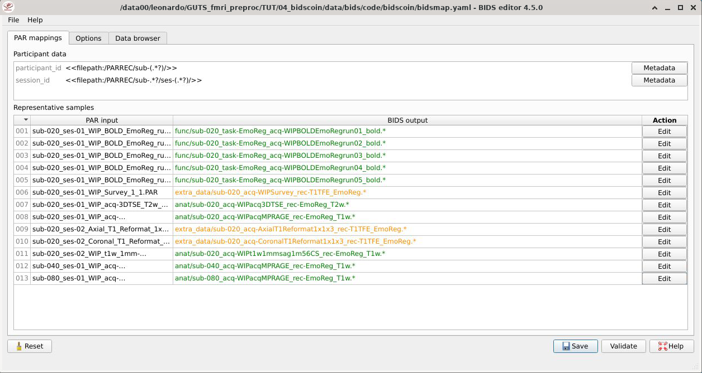
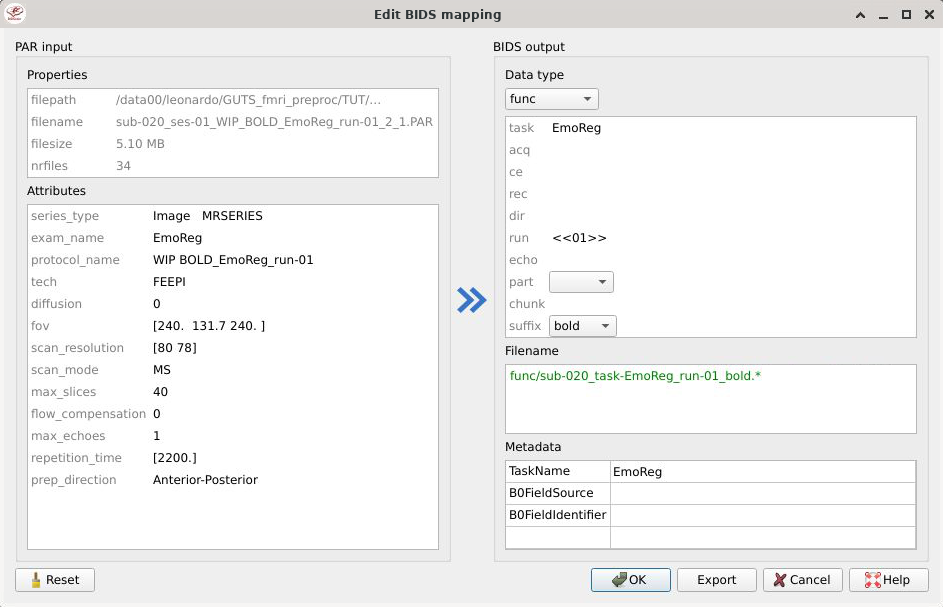
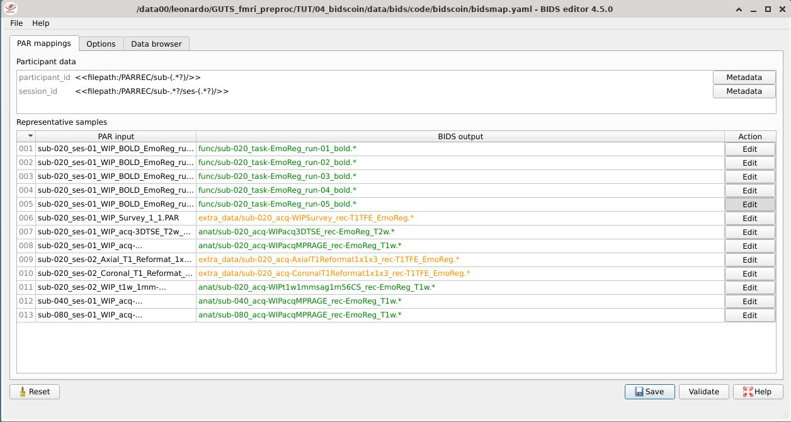

# Bidscoin + trimming PAR files

LC feb 2025

[bidscoin](https://bidscoin.readthedocs.io/en/latest/index.html) is a python software to generate bids-compliant nii starting from dcm and PAR/REC. It is particularly interesting for us since it handles the latter format, which is the most common in out lab (as we work on a Philips scanner).

Importantly, bids is not only about the naming convention for the images, but also about the associated .json files that bear the same name of the image - as well as other .json files for additional study/participant information. Bidscoin takes care of creating also these files, and that's one of the reason why it is so great. (Thanks a lot to Tomas Knapen for informing me about the existance of bidscoin).

Under the hood, it appears that one can use several converters, however the most common choice is usually [dcm2niix](https://github.com/rordenlab/dcm2niix) (whose development by the way does not include anymore PAR/REC conversion).

In addition, we often abort the functional scan before its expected end when we acquire bold sequences - to save time. In these cases, dcm2niix refuses to proceed and refers us to [dicm2nii](https://github.com/xiangruili/dicm2nii) (Matlab/Octave script) or to [R2Agui](https://r2agui.sourceforge.net/). The latter is not even worth considering, since the latest release is from 2009 - and this causes problems with PAR/REC generated by newer version of the scanner software. The former does actually produce (some) nii, but does not take care of the bids format or .json files.

Therefore, in addition to showing how one can use bidscoin, we will also show how to trim the PAR file - when the bold sequence was aborted - so that they can be then converted by dcm2niix within bidscoin.

## Preparing the data

## Creating a suitable structure for bidscoin
The sample data I will use in this tutorial is too big to be uploaded on github, however you can use any PAR/REC data available to you, and hopefully you will have the same result. The structure, for our sample data, is the following:

<details>
<summary>Sample data</summary>

```
source/
├── sub-020
│   ├── ses-01
│   │   ├── anat
│   │   │   ├── sub-020_ses-01_WIP_Survey_1_1.PAR
│   │   │   ├── sub-020_ses-01_WIP_Survey_1_1.REC
│   │   │   ├── sub-020_ses-01_WIP_acq-3DTSE_T2w_6_1.PAR
│   │   │   ├── sub-020_ses-01_WIP_acq-3DTSE_T2w_6_1.REC
│   │   │   ├── sub-020_ses-01_WIP_acq-MPRAGE_T1w_5_1.PAR
│   │   │   └── sub-020_ses-01_WIP_acq-MPRAGE_T1w_5_1.REC
│   │   ├── beh
│   │   │   ├── logsevent_log_sub_020_ses_1_run_1.csv
│   │   │   ├── logsevent_log_sub_020_ses_1_run_2.csv
│   │   │   ├── logsevent_log_sub_020_ses_1_run_3.csv
│   │   │   ├── logsevent_log_sub_020_ses_1_run_4.csv
│   │   │   └── logsevent_log_sub_020_ses_1_run_5.csv
│   │   ├── eye
│   │   │   ├── sub-020_ses-01_LiveTrackData_2023-11-21T111632.txt
│   │   │   └── sub-020_ses-01_LiveTrackData_2023-11-21T111632_meta.txt
│   │   └── func
│   │       ├── sub-020_ses-01_WIP_BOLD_EmoReg_run-01_2_1.PAR
│   │       ├── sub-020_ses-01_WIP_BOLD_EmoReg_run-01_2_1.REC
│   │       ├── sub-020_ses-01_WIP_BOLD_EmoReg_run-02_3_1.PAR
│   │       ├── sub-020_ses-01_WIP_BOLD_EmoReg_run-02_3_1.REC
│   │       ├── sub-020_ses-01_WIP_BOLD_EmoReg_run-03_4_1.PAR
│   │       ├── sub-020_ses-01_WIP_BOLD_EmoReg_run-03_4_1.REC
│   │       ├── sub-020_ses-01_WIP_BOLD_EmoReg_run-04_7_1.PAR
│   │       ├── sub-020_ses-01_WIP_BOLD_EmoReg_run-04_7_1.REC
│   │       ├── sub-020_ses-01_WIP_BOLD_EmoReg_run-05_8_1.PAR
│   │       └── sub-020_ses-01_WIP_BOLD_EmoReg_run-05_8_1.REC
│   └── ses-02
│       ├── anat
│       │   ├── sub-020_ses-02_Axial_T1_Reformat_1x1x3_5_3.PAR
│       │   ├── sub-020_ses-02_Axial_T1_Reformat_1x1x3_5_3.REC
│       │   ├── sub-020_ses-02_Coronal_T1_Reformat_1x1x3_5_2.PAR
│       │   ├── sub-020_ses-02_Coronal_T1_Reformat_1x1x3_5_2.REC
│       │   ├── sub-020_ses-02_WIP_Survey_1_1.PAR
│       │   ├── sub-020_ses-02_WIP_Survey_1_1.REC
│       │   ├── sub-020_ses-02_WIP_t1w_1mm-sag_1m56_CS_5_1.PAR
│       │   └── sub-020_ses-02_WIP_t1w_1mm-sag_1m56_CS_5_1.REC
│       ├── beh
│       │   ├── logsevent_log_sub_020_ses_2_run_10.csv
│       │   ├── logsevent_log_sub_020_ses_2_run_6.csv
│       │   ├── logsevent_log_sub_020_ses_2_run_7.csv
│       │   ├── logsevent_log_sub_020_ses_2_run_8.csv
│       │   └── logsevent_log_sub_020_ses_2_run_9.csv
│       ├── eye
│       │   ├── sub-020_ses-02_LiveTrackData_2023-11-21T142745.txt
│       │   └── sub-020_ses-02_LiveTrackData_2023-11-21T142745_meta.txt
│       └── func
│           ├── sub-020_ses-02_WIP_BOLD_EmoReg_run-01_2_1.PAR
│           ├── sub-020_ses-02_WIP_BOLD_EmoReg_run-01_2_1.REC
│           ├── sub-020_ses-02_WIP_BOLD_EmoReg_run-02_3_1.PAR
│           ├── sub-020_ses-02_WIP_BOLD_EmoReg_run-02_3_1.REC
│           ├── sub-020_ses-02_WIP_BOLD_EmoReg_run-03_4_1.PAR
│           ├── sub-020_ses-02_WIP_BOLD_EmoReg_run-03_4_1.REC
│           ├── sub-020_ses-02_WIP_BOLD_EmoReg_run-04_6_1.PAR
│           ├── sub-020_ses-02_WIP_BOLD_EmoReg_run-04_6_1.REC
│           ├── sub-020_ses-02_WIP_BOLD_EmoReg_run-05_7_1.PAR
│           └── sub-020_ses-02_WIP_BOLD_EmoReg_run-05_7_1.REC
├── sub-040
```
</details>

\
For PAR/REC files, bidscoin expects the following structure:

```
PARREC/
├── sub-020
│   ├── [all the PARREC files here]
├── sub-030
│   ├── [all the PARREC files here]
├── sub-040
│   ├── [all the PARREC files here]
```
Of course the name of the source directory (PARREC in this case) and of the subfolders with the subjects (sub-020,030,040) are arbitrary. What really matters is that for each subject *all the PAR/REC files are in the same directory*, so no subdirs with e.g. func, anat and so on.

To achieve this, we can create a PARREC dir and copy all the PAR/REC files (and only those) in there for each sub. 

*NB: Here and in the folllowing I will use very simplified (and q&d) bash commands tailored to my sample data. You can build more personalized versions for your specific case*

```bash
# Launch this from the root directory (the dir which has a data/source subdir)
for sub in $(find data/source -type d -name "sub-*" | awk -F/ '{print $3}'); do

    mkdir -p data/PARREC/${sub}

    for PAR_file in $(find data/source/${sub} -type f -name "*.PAR"); do
        cp ${PAR_file} data/PARREC/${sub}/
    done

    for REC_file in $(find data/source/${sub} -type f -name "*.REC"); do
        cp ${REC_file} data/PARREC/${sub}/
    done

done
```

### Trimming the PAR file
The issue with aborted BOLD sequences is the following: the PAR file contains both the expected number of slices per volume (in the header), as well as lines that index the slices for each TR. When we abort an acquisition, this likely happens in the middle of a TR, therefore there number of lines indexing the slices in the last acquired (but not complete) TR are not as many as expected in the header. This means that the number of lines for slices is not divisible by the expected number of slices. At this point dcm2niix throws an error and stops.

Therefore we need to manually delete the lines corresponding to the last incomplete TR. To this aim, I wrote an *extremely basic* bash script that you can find below. **Note that you cannot use this script as it is. Instead you need to adapt it to your particular case.**

<details><summary>do_trim_single_PAR.sh</summary>

```bash
#!/bin/bash

# Assuming that all the BOLD scans have n_slices slices
# NB: there should be a space in front of the number of slices!
# Check your own PAR file to determine if this holds for you
n_slices=" 40"

[ -f PARs_NOT_TRIMMED.txt ] && rm PARs_NOT_TRIMMED.txt

# Check for input file argument
if [ "$#" -ne 1 ]; then
    echo "Usage: $0 <path_to_PAR_file>"
    exit 1
fi

file="$1"
backup="${file}_OLE"

# Create a backup
cp "${file}" "${backup}"
echo "Backup created: ${backup}"

# Find the last line number where the line starts with "40"
last_complete_acq_line=$(grep -n "^${n_slices}" "${file}" | tail -n1 | awk -F: '{print $1}')

# If no line starts with 40, exit without modifying the file
if [ -z "${last_complete_acq_line}" ]; then
    echo "${file} : No line starting with ${n_slices} found. No changes made."
    echo "${file}" >> PARs_NOT_TRIMMED.txt
    exit 0
fi

# Trim the file up to and including the last "40" line
echo "Trimming ${file}"
head -n "${last_complete_acq_line}" "${backup}" > "${file}"
```

</details>

\
In the case of the sample data, there were 40 slices per volume, therefore I want to identify and delete the extra lines under the last one starting with "` 40`" (the space is important, see the script).

The two crucial lines here are the following:
```bash
# Identify the last line that starts with ${n_slices} and record the line number in the  variable
last_complete_acq_line=$(grep -n "^${n_slices}" "${file}" | tail -n1 | awk -F: '{print $1}')

...

# Print all the lines until the last line that starts with ${n_slices} into a new file
head -n "${last_complete_acq_line}" "${backup}" > "${file}"

```

We can trim all PAR files in the `data/PARREC` dir with the following:
```bash
for PAR_file in $(find data/PARREC -type f -name "*.PAR"); do 
    ./do_trim_single_PAR.sh ${PAR_file}; 
done
```

Now all the PAR files end with a line indexing the last 40th slice (since we set up our bold acquisition to have 40 slices)

NB: The script saves the original PAR file in a new file with extension `PAR_OLE`. Note that re-running the script a second time would not change the (new, trimmed) PAR file, but would overwrite the `PAR_OLE` file. If you have a copy of the original PAR/REC files (hence the comment in the command below, in case you didn't read this), you can safely delete them with the following:
```bash
# find data/PARREC/ -type f -name "*.PAR_OLE" -exec rm {} +
```

Now we are (almost) ready to use bidscoin. But first let's make sure we use the right converter.

## Choosing the dcm2niix that bidscoin will use
By default, bidscoin uses dcm2niix to convert the PAR/REC into bids-compliant nii.gz files. You can also install dcm2niix when installing bidscoin (see [here](https://bidscoin.readthedocs.io/en/latest/installation.html)). However with the version of dcm2niix installed by pip, I experienced a problem: the TR is not recorded *neither* in the .json file associated with each bold nii.gz, *nor* in the .nii.gz header - which is probably even more worrisome.

Here I use a version of dcm2niix which apparently comes in the latest (for me - dec 2024) installation of fsl. By using that, both the bids and the nii.gz header correctly store the TR of my bold acquisition.

In general, to use a specific version of dcm2niix that you have installed on your computer, one safe way is to define it in your `~/.bashrc` or `./.bash_profile` file, so that it will be read when you open a (bash) terminal. For instance, you can add the following line:
```bash
export dcm2niix="/usr/local/fsl/bin/dcm2niix"
```

For the record, this is the version I am using:

```
Chris Rorden's dcm2niiX version v1.0.20220720  GCC10.4.0 x86-64 (64-bit Linux)
v1.0.2022072
```

If you use another version, just test it on a couple of PAR/REC files and make sure that the header of the nii.gz and the corresponding 

## Bidscoin
NB: bidscoin has an excellent [documentation](https://bidscoin.readthedocs.io/en/latest/index.html). Here I will just describe succintly a few steps to go from our PAR/REC files in the `PARREC` directory to the `bids` directory created by bidscoin, which contains the nii.gz and associated .json files 

### Installing bidscoin

Bidscoin is a python software which you can install with pip. It is therefore a good practice to also create a virtual environment before installing it:

```bash
python -m venv venv
source venv/bin/activate
pip install bidscoin
```

### Building a mapper with bidsmapper
At this point we can open an X terminal (which means inside for instance x2goclient) and type the following, with the indication of the source and the destination dirs. Here I assume we are in the `data` directory:

```bash
bidsmapper PARREC/ bids/
```
If everything went well, you will be welcomed by the initial screen of bidsmapper.



From here, you can modify several options in the final naming scheme of the files, as well as the fields to input in the .json files. For instance, here I edit one bold sequence to shorten the final name, and to have an indication of the run. I also manually edit the TaskName field of the .json file (in the Metadata in the bottom right).



Then I do the same for all runs, so that the final screen looks as follows:



At this point I can save this setting. This will generate a `bidsmap.yaml` file with all the settings required for creating the bids structure / files

```
data/bids/
└── code
    └── bidscoin
        ├── bidsmap.yaml
        ├── bidsmapper.errors
        └── bidsmapper.log
```

Note that you can reopen the same file later and make modifications. In particular, it can be a good idea to run the bidsmapper only on a couple of participants to make the appropriate edits to the bidsmap.yml, and then - when you are happy with the result - re-run it on the whole set of participants.

### Building bids-compliant files
Now it's the moment of truth. To generate the structure, nii.gz and associated .json files, simply issue:

```bash
bidscoiner PARREC/ bids/
```

This is how the resulting `bids` directory looks for my sample data:

<details><summary> bids directory after bidscoiner</summary>

```
data/bids/
├── README
├── code
│   └── bidscoin
│       ├── bidscoiner.errors
│       ├── bidscoiner.log
│       ├── bidscoiner.tsv
│       ├── bidsmap.yaml
│       ├── bidsmapper.errors
│       └── bidsmapper.log
├── dataset_description.json
├── participants.json
├── participants.tsv
├── sub-020
│   ├── anat
│   │   ├── sub-020_acq-WIPacq3DTSE_rec-EmoReg_T2w.json
│   │   ├── sub-020_acq-WIPacq3DTSE_rec-EmoReg_T2w.nii.gz
│   │   ├── sub-020_acq-WIPacqMPRAGE_rec-EmoReg_T1w.json
│   │   ├── sub-020_acq-WIPacqMPRAGE_rec-EmoReg_T1w.nii.gz
│   │   ├── sub-020_acq-WIPt1w1mmsag1m56CS_rec-EmoReg_T1w.json
│   │   └── sub-020_acq-WIPt1w1mmsag1m56CS_rec-EmoReg_T1w.nii.gz
│   ├── extra_data
│   │   ├── sub-020_acq-AxialT1Reformat1x1x3_rec-T1TFE_EmoReg.json
│   │   ├── sub-020_acq-AxialT1Reformat1x1x3_rec-T1TFE_EmoReg.nii.gz
│   │   ├── sub-020_acq-CoronalT1Reformat1x1x3_rec-T1TFE_EmoReg.json
│   │   ├── sub-020_acq-CoronalT1Reformat1x1x3_rec-T1TFE_EmoReg.nii.gz
│   │   ├── sub-020_acq-WIPSurvey_rec-T1TFE_run-1_EmoReg.json
│   │   ├── sub-020_acq-WIPSurvey_rec-T1TFE_run-1_EmoReg.nii.gz
│   │   ├── sub-020_acq-WIPSurvey_rec-T1TFE_run-2_EmoReg.json
│   │   └── sub-020_acq-WIPSurvey_rec-T1TFE_run-2_EmoReg.nii.gz
│   ├── func
│   │   ├── sub-020_task-EmoReg_run-01_bold.json
│   │   ├── sub-020_task-EmoReg_run-01_bold.nii.gz
│   │   ├── sub-020_task-EmoReg_run-02_bold.json
│   │   ├── sub-020_task-EmoReg_run-02_bold.nii.gz
│   │   ├── sub-020_task-EmoReg_run-03_bold.json
│   │   ├── sub-020_task-EmoReg_run-03_bold.nii.gz
│   │   ├── sub-020_task-EmoReg_run-04_bold.json
│   │   ├── sub-020_task-EmoReg_run-04_bold.nii.gz
│   │   ├── sub-020_task-EmoReg_run-05_bold.json
│   │   ├── sub-020_task-EmoReg_run-05_bold.nii.gz
│   │   ├── sub-020_task-EmoReg_run-2_bold.json
│   │   ├── sub-020_task-EmoReg_run-2_bold.nii.gz
│   │   ├── sub-020_task-EmoReg_run-3_bold.json
│   │   ├── sub-020_task-EmoReg_run-3_bold.nii.gz
│   │   ├── sub-020_task-EmoReg_run-4_bold.json
│   │   ├── sub-020_task-EmoReg_run-4_bold.nii.gz
│   │   ├── sub-020_task-EmoReg_run-5_bold.json
│   │   ├── sub-020_task-EmoReg_run-5_bold.nii.gz
│   │   ├── sub-020_task-EmoReg_run-6_bold.json
│   │   └── sub-020_task-EmoReg_run-6_bold.nii.gz
│   └── sub-020_scans.tsv
├── sub-040
│   ├── anat

```

</details>

\
The last step is to make a check with the [bids validator](https://bids-standard.github.io/bids-validator/). Everything looks fine - besides the extra data, that you can remove at your necessity if you need to use a BIDS app.

