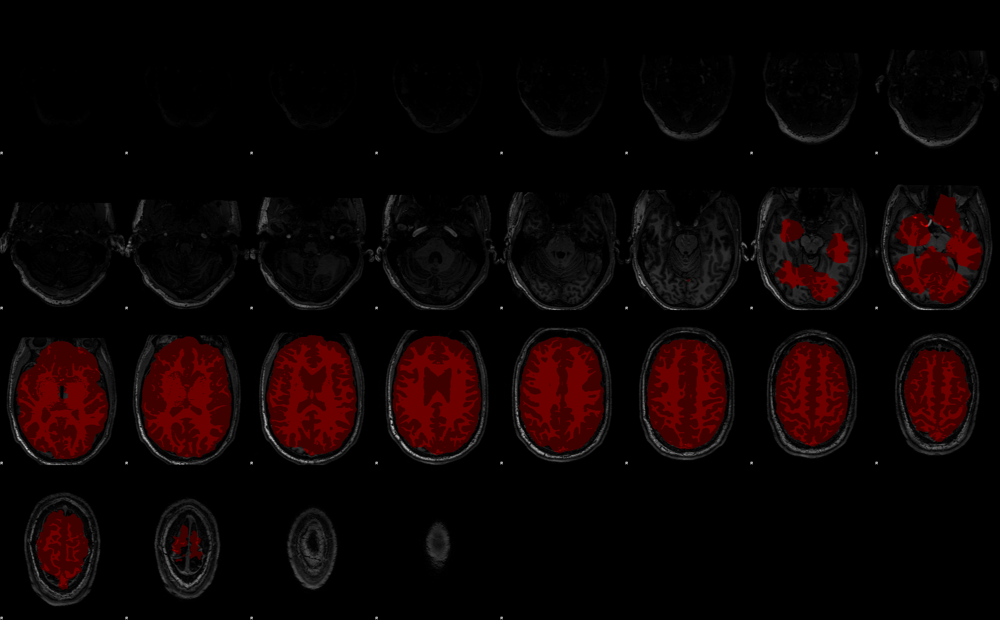

## Skull strip of T1w image



Launch with:
```bash
./launch_skullstrip.sh
```

Expects to find a list of subjects - one per row - in the text file `subject_list="subject_list.txt"`

T1w images from the `Data_collection` folder are copied into the `Data_analysis` folder, since fsl fnirt requires the original un-stripped image for nonlinear registration

Inhomogeneities in the image intensity are first corrected with ANTs' `N4BiasFieldCorrection`.

Skullstrip is carried out in docker with [SynthStrip](https://surfer.nmr.mgh.harvard.edu/docs/synthstrip/) which in this case achieves a better result than ANTs `antsBrainExtraction.sh`. This is done using the `synthstrip-docker` script. 

**NB**: Since our files are mounted from windoze server, a small modification has been made to the `synthstrip-docker`:

```bash
# Set UID and GID to avoid output files owned by root
# user = '-u %s:%s' % (os.getuid(), os.getgid())
user = ""  # instead of '-u %s:%s' % (os.getuid(), os.getgid())
```

A quick and dirty quality check of the results can be carried out with the following:

```bash
root="/dataGUTS2/GUTS/WP3/Data_analysis"
imlist=$(find ${root} \( -name "*T1w_N4.nii.gz" -o -name "*T1w_N4_brain.nii.gz" \))
slicesdir -o -e -0.1 ${imlist}
```

Otherwise you can use (or adapt) the `do_overlay.sh` script which produces images like the one on top.
This assumes you have [fsl](https://fsl.fmrib.ox.ac.uk/fsl/docs/) and pandoc.


**Input looks like this**
```bash
# /dataGUTS2/GUTS/WP3/Data_collection/newpps/raw_data/bids
sub-gutsaumc0002/
└── ses-1
    └── anat
        ├── sub-gutsaumc0002_ses-1_T1w.json
        └── sub-gutsaumc0002_ses-1_T1w.nii.gz
```


**Output**
```bash
# /dataGUTS2/GUTS/WP3/Data_analysis
sub-gutsaumc0002/
└── anat
    ├── sub-gutsaumc0002_ses-1_T1w_N4.nii.gz
    ├── sub-gutsaumc0002_ses-1_T1w_N4_brain.nii.gz
    ├── sub-gutsaumc0002_ses-1_T1w_N4_brain_mask.nii.gz
    ├── sub-gutsaumc0002_ses-1_T1w_RAW.nii.gz
    └── sub-gutsaumc0002_ses-1_T1w_bias.nii.gz
```

Other tools for skullstrip can be found [here](https://neurostars.org/t/how-can-i-improve-ants-brain-extraction-performance/34310).

