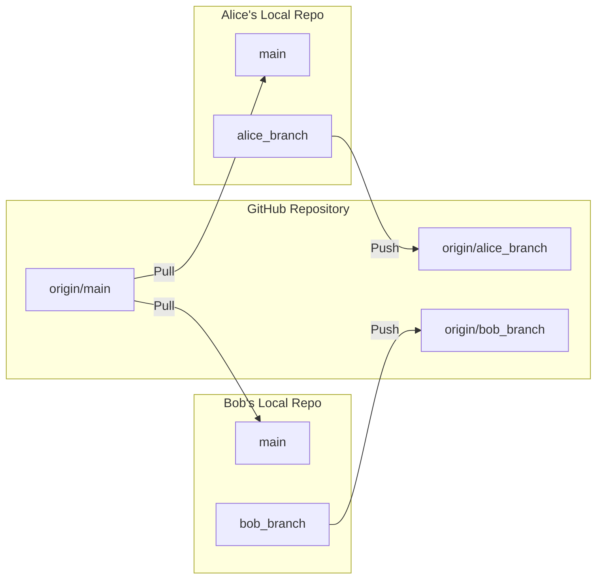

# Collaborating on GitHub with Dedicated Branches: A Tutorial

LC feb 2025

This tutorial outlines a simple workflow for collaborating on a GitHub repository using one single dedicated branch for each contributor. The aim is to describe a situation where the collaborators can each one work on the same repo without having unwanted breaks of their code. This will require them to revise the changes made by either of them before merging them into the main code base. (The same goes if the repo just contains documentation, of course)

**We will imagine two users: **Alice** and **Bob**. Alice creates the repo, and invites Bob as a collaborator**. We will cover creating a repository, adding a collaborator, setting up individual branches, making changes, submitting a pull request, and keeping branches synchronized.





\
**NB 1**: Having branches with the names of the users is by far not the best of structuring the collaboration on a shared github repo - for instance, it would be better for each user to have several branches, each one related to a specific feature she is working on, and a correspondingly descriptive name. 

**NB 2**: Also, this very simple and basic solution is not ideal since every time either user will push modifications to the remote repo, a banner will appear requesting revisions. A better way to structure this is to have each user working on their own fork of the original repo, pushing remote modifications to their own forks, and making pull requests to the main repo _only when they deem the work made within the fork is ready to be merged in the main repo_. There is a small section on this below about [collaborating with forks](#forks-workflow).

Having said that, let's get started.

## Prerequisites

*   A GitHub account for both collaborators (alice and bob).
*   Git installed on both collaborators' local machines.

## 0. TL/DR - Main git commands used
```bash
# Inspect existing branches : local in white, current in green, remote in red
git branch -a

# Creating a local branch
git branch alice

# Switching to a branch
git checkout alice

# Pushing to the (corresponding) remote branch after having made some
# local addition/changes
git push -u origin alice

# At this point the owner of the repo will see a banner appearing with revisions
# required (pull request). If the merge is accepted, it will change the main branch.
#
# After the merge has succeeded, each user can update their own branch to include the latest updates in the main using:
git checkout alice
git pull origin main

```


## 1. Creating the Repository (Alice)

1.  **Create a new repository on GitHub:**
    *   Log in to GitHub with the `alice` account.
    *   Click the "+" icon in the top right corner and select "New repository".
    *   Name the repository (e.g., `test_collaboration`).
    *   Add a basic `README.md` file (initialize the repository with a README).
    *   Choose a license if desired.
    *   Click "Create repository".

## 2. Adding a Collaborator (Alice)

1.  **Invite Bob to collaborate:**
    *   Go to the repository's page.
    *   Click on "Settings".
    *   Click on "Collaborators".
    *   Type `bob`'s GitHub username in the search box.
    *   Click "Add collaborator".
    *   Bob will receive an invitation to accept.

## 3. Setting Up Local and Remote Branches (Alice and Bob)

Each collaborator will now clone the repository and create their own dedicated branch.

**Steps for both alice and bob:**

1.  **Clone the repository:**

    ```bash
    git clone https://github.com/alice/test_collaboration.git
    cd test_collaboration
    ```

    (Replace `alice` with the actual GitHub username of Alice).

2.  **Create a dedicated branch:**

    *   **alice:**

        ```bash
        git checkout main # ensure you are on the main branch
        git pull # update with the latest version of main
        git branch alice_branch
        git checkout alice_branch
        ```

    *   **bob:**

        ```bash
        git checkout main # ensure you are on the main branch
        git pull # update with the latest version of main
        git branch bob_branch
        git checkout bob_branch
        ```

3.  **Push the branch to GitHub:**

    *   **alice:**

        ```bash
        git push -u origin alice_branch
        ```

    *   **bob:**

        ```bash
        git push -u origin bob_branch
        ```

    The `-u` flag sets up tracking between the local and remote branch. You only need to use it the first time you push a new branch.

## 4. Making Changes and Pushing (Bob)

1.  **Make changes to `README.md`:** Open the `README.md` file in a text editor and make some modifications (e.g., add a sentence about Bob).

2.  **Stage and commit changes:**

    ```bash
    git add README.md
    git commit -m "Bob updated README.md"
    ```

3.  **Push changes to the remote branch:**

    ```bash
    git push
    ```

## 5. Reviewing and Merging (Alice)

1.  **Go to the repository on GitHub:**
    *   Alice will see a "Compare & pull request" banner. Click it.

2.  **Review the changes:**
    *   Examine the changes in the "Files changed" tab.
    *   Ensure the title and description are clear.
    *   Add comments if needed.

3.  **Merge the pull request:**
    *   Click the "Merge pull request" button.
    *   Confirm the merge.

## 6. Updating Local Branches (Alice and Bob)

After Alice merges Bob's changes, both Alice and Bob need to update their local `main` and dedicated branches.

**Steps for both alice and bob:**

1.  **Checkout the `main` branch:**

    ```bash
    git checkout main
    ```

2.  **Pull the latest changes:**

    ```bash
    git pull origin main
    ```

3.  **Checkout the dedicated branch:**

    *   **alice:**

        ```bash
        git checkout alice_branch
        ```

    *   **bob:**

        ```bash
        git checkout bob_branch
        ```

4.  **Merge the changes from `main` into the dedicated branch:**

    *   **alice:**

        ```bash
        git pull origin main
        ```

    *   **bob:**

        ```bash
        git pull origin main
        ```

5.  **Push your dedicated branch to github, to keep it synch**
    * **alice**
    ```bash
    git push origin alice_branch
    ```
    * **bob**
    ```bash
    git push origin bob_branch
    ```

Now, both alice and bob's local `main` branch and dedicated branches are up-to-date with the merged changes.

## Conclusion (of this very simple option)

This tutorial provides a basic workflow for collaborating on a GitHub repository using dedicated branches. Remember to communicate clearly with your collaborators and to regularly update your branches to avoid conflicts. This workflow allows you to collaborate, while limiting the number of pull requests and branches and limiting the probability of error.


## <a id="forks-workflow"></a>A Better Way: Collaborating with Forks

The drawback of the approch above is that every time Bob or Alice push something to the remote repo, a pull request will be initiated. This is not ideal, because on the one hand both Bob and Alice want to save interim work remotely not to risk losing it, but on the other hand this leads to a spam of pull requests.

The solution is using forks.

Using forks provides a cleaner and more isolated workflow for collaboration, especially when multiple contributors are involved. Here's how it works:

**Advantages of Using Forks:**

*   **Clean separation of concerns:** Your work-in-progress is completely isolated from the original repository. You can experiment and iterate without directly affecting the main codebase.
*   **No notification spam:** The owner of the original repository only receives a pull request notification when you explicitly create a pull request from your fork, avoiding constant notifications for unfinished work.
*   **Independent workflow:** You can manage your own workflow (branching, committing, pushing) within your fork without interfering with the workflow of the original repository.
*   **Easy experimentation:** You can freely experiment with new ideas without the risk of disrupting the main repository.
*   **Standard practice:** Forking is the standard model for open-source contributions, and it's a valuable skill to learn.

**Steps for Contributing Using Forks (Bob's Perspective):**

1.  **Fork the repository:**
    *   Go to the original repository (e.g., `alice/test_collaborators`).
    *   Click the "Fork" button in the top right corner.
    *   Choose your account to create the fork.

2.  **Clone your forked repository:**

    ```bash
    git clone https://github.com/bob/test_collaborators.git
    cd test_collaborators
    ```

3.  **Create a branch for your changes (optional but highly recommended):**

    ```bash
    git checkout -b my-cool-feature
    ```

4.  **Make your changes:** Edit files, add new files, etc.

5.  **Stage and commit your changes:**

    ```bash
    git add .
    git commit -m "Implement my cool feature"
    ```

6.  **Push your changes to your forked repository:**

    ```bash
    git push origin my-cool-feature
    ```

7.  **Create a pull request (on GitHub Website):**
    *   Go to your forked repository on GitHub.
    *   If you recently pushed your branch, GitHub might display a "Compare & pull request" button. Click that button.
    *   Alternatively, click on the "Pull requests" tab and then the "New pull request" button.

8.  **Configure the pull request (very important):**

    *   **"base repository":** Ensure the "base repository" (the repository you want to merge *into*) is set to the original repository: `alice/test_collaborators`.
    *   **"base":** Ensure the "base branch" is set to the branch on the original repository that you want to merge into (usually `main`).
    *   **"head repository":** Ensure the "head repository" (your repository that contains the changes) is set to your forked repository: `bob/test_collaborators`.
    *   **"compare":** Ensure the "compare branch" (the branch on your fork that contains the changes) is set to the branch you want to merge (e.g., `my-cool-feature`).

    *   **Review the selections *carefully*!** Double-check that you're merging the correct branch from your fork into the correct branch of Alice's repository.

9.  **Write a clear title and description:**
    *   Give your pull request a clear and concise title that summarizes the changes.
    *   Write a detailed description explaining the purpose of the changes, why they are needed, and any relevant context.

10. **Create the pull request:**
    *   Click the "Create pull request" button.

Now the owner of the original repository (Alice) can review your pull request and merge your changes.